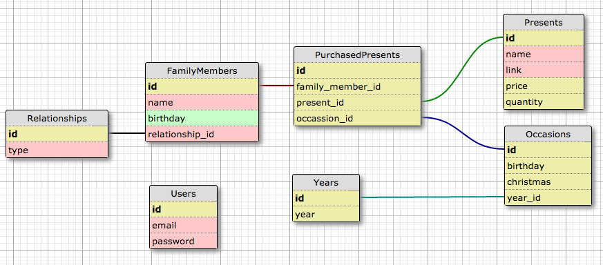

# SUPER DUPER PRESENT TRACKING SYSTEM

I didn't want to use a spreadsheet to track my presents, so I built this. It allows you to track what presents were purchased for birthdays/Christmases.

```
git@github.com:notmarkmiranda/present_tracker_rails.git
cd present_tracker_rails
bundle
rake db:create db:migrate db:seed
rails s
```

There is no user creation workflow, the default user information is:
```
e-mail: test@example.com
password: password
```

You can update /db/seeds.rb to change the default user information

Navigate to http://localhost:3000 in your browser.

The is the current version of the schema. I will update accordingly.

